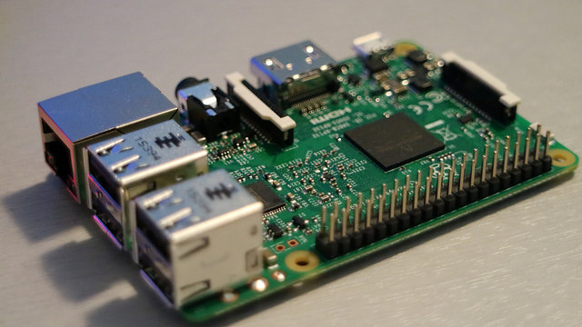
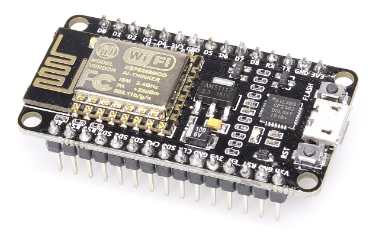

# IoT - Internet of Things

Eines der Themen für den [PIT-Hackathon 2019](https://github.com/PIT-Hackathon/2019-Infos) ist die Entwicklung eines IoT Systems und auf dieser Seite erfährst Du, was es mit dem Thema auf sich hat. Falls das etwas für Dich ist, kannst Du Dich mit Hilfe von ein paar kleinen Aufgaben schon ein bisschen vorbereiten - musst es aber natürlich nicht.

## Was ist IoT?

Der Begriff IoT steht für *Internet of Things* bzw. das Internet der Dinge. Grob gesagt wird versucht, die analoge Welt um uns herum digital greifbar zu machen, um mit diesen Daten neue Informationen zu gewinnen und sie weiterzuverarbeiten. Sei es ein einfacher Schalter oder ein Bewegungssensor, die Wetterstation oder das Hamsterrad - alles kann Daten liefern und ins Netz gestellt werden. Genauso können die vernetzten Geräte auf diese Daten zugreifen und selbst wieder auf andere Daten reagieren.

## Was muss ich können/mitbringen, um eine IoT Anwendung beim Hackathon zu entwickeln?

Spaß am Basteln und gute Ideen. Evtl. kennst Du bereits den Arduino, den Raspberry Pi, den ATTiny oder eine NodeMCU (ESP8266/ESP32) und hast schon einmal damit gearbeitet oder Du kennst Dich etwas mit Elektronik aus.

## Das hört sich schon mal gut an - wie geht es weiter?

Welches Thema Du wählen möchtest, musst Du erst zu Beginn des Hackathons entscheiden. Vielleicht informierst Du Dich schon einmal vorab bei den [anderen Themen](https://github.com/PIT-Hackathon/2019-Infos), ob noch eine Alternative für Dich dabei ist.

## Kann ich mich schon irgendwie vorbereiten?

Eine Vorbereitung ist nicht notwendig, würde es Dir aber natürlich ermöglichen, an dem Wochenende des Hackathons tiefer in das Thema einzusteigen. Falls Du also schon einmal ins Thema reinschnuppern möchtest, findest Du hier ein paar Links. Schaue Dir doch mal ein paar Tutorials an, vielleicht hast Du ja schon eine gute Idee, die Du während des Hackathons kurz vorstellen und dann gemeinsam in der Gruppe umsetzen möchtest.

Zusätzlich zu Deinen eigenen Ideen wird es von den Mentoren Vorschläge zum Thema IoT geben, die in diesem Jahr unter der Überschrift "Digitale Stadt" stehen. Hierbei geht es um die Entwicklung von Systemen (Prototypen), die letztendlich das Wohnen und Arbeiten in Deiner Stadt vereinfachen oder verbessern könnten. Vorstellbar sind zum Beispiel die Überwachung von Parkplätzen (für Autos und Fahrräder), die Meldung von Pegelständen (Hochwasserwarnungen), das grobe Zählen anwesender Personen bei Versammlungen (für Rettungsdienste) und vieles mehr. 

### Hardware / Software

Für den Hackathon haben wir eine Auswahl an Hardware zusammengestellt, mit der wir im Bereich Internet of Things arbeiten wollen.

#### Raspberry Pi

Einst als kleiner und günstiger Computer für Schulen und die Lehre entwickelt, hat sich der Raspberry Pi als Bastelrechner durchgesetzt. Er kommt während des Hackathons als Steuerzentrale für das IoT zum Einsatz und kann zusätzlich über eine Erweiterungsschnittstelle selbst Hardwaremodule ansprechen.

- <https://tutorials-raspberrypi.de/>

#### NodeMCU / ESP8266 / ESP32

Die NodeMCU-Hardware ist eine Mikrocontroller-Plattform, die sich u.a. mit der Arduino IDE programmieren lässt. Da sie sehr günstig ist und zudem auch WLAN mitbringt (der ESP32 hat zusätzlich Bluetooth LE zu bieten), ist sie bestens geeignet, um Sensorknoten für ein IoT-System zu entwickeln. Im Gegensatz zum Raspberry Pi ist sie natürlich nicht so leistungsfähig, dennoch reicht die Geschwindigkeit zum Erfassen und Senden von Sensordaten mehr als aus.

- <http://www.mikrocontroller-elektronik.de/nodemcu-esp8266-tutorial-wlan-board-arduino-ide/>

#### Sensoren

Damit Du Deine IoT-Idee umsetzen kannst, haben wir eine Auswahl an Sensoren und Aktoren zusammengestellt, die Dir und den anderen Gruppen während des Hackathons zur Verfügung stehen wird. Schau Dir doch einmal die Liste an; vielleicht hast Du ja eine gute Idee, was für ein Projekt man mit den vorhandenen Bauteilen umsetzen könnte. Die genauen Bezeichnungen der Module können Dir helfen, mehr Informationen zu den einzelnen Komponenten zu finden.

- NFC Module (RC522 RFID-Modul) und passende NFC Tags zur kontaktlosen Kommunikation ([Arduino Bibliothek](https://github.com/miguelbalboa/rfid))
- Kameramodul für den Raspberry Pi
- Adafruit NeoPixel Stick
- Temperatur- / Luftfeuchtigkeitssensoren (DHT22)
- Gyroskop (Lagesensor, der Bewegungen in unterschiedliche Richtungen erkennen kann - ITG3205)
- Hallsensoren, Fotodioden, Joysticks und vieles mehr im [Arduino Sensorpaket](https://tkkrlab.nl/wiki/Arduino_37_sensors)
- 433MHz Sender zum Steuern von Funksteckdosen
- ... und viele weitere Sensoren und Aktoren

#### MQTT - MQ Telemetry Transport oder Message Queue Telemetry Transport

MQTT ist ein Nachrichtenprotokoll für die sogenannte M2M (Machine to Machine) Kommunikation. Es ist relativ leichtgewichtig, wird sowohl vom Raspberry Pi als auch von den NodeMCU Mikrocontrollern unterstützt, hat sich im Bereich IoT einen festen Platz ergattert und soll damit als Grundlage für die Kommunikation während des Hackathons dienen.

Die Kommunikation mit dem Server (im MQTT Umfeld auch Broker genannt) erfolgt von Seiten der Clients über Topics, auf die sie lesen oder schreiben können. Topics können dabei hierarchisch angelegt werden. Ein Beispiel wäre eine Wetterstation, die in das Topic "/wetter/paderborn/temperatur" jeweils die aktuelle Temperatur hineinschreibt. Ein weiterer Client könnte dann auf dieses Topic lauschen und wird vom Broker benachrichtigt, wenn es neue Ereignisse zum jeweiligen Topic gibt.

- [Einführung in MQTT](https://www.predic8.de/mqtt.htm)

#### LoRaWAN und The Things Network (TTN)

Für Sensordaten immer beliebter wird LoRa bzw. [LoRaWAN](https://de.wikipedia.org/wiki/Long_Range_Wide_Area_Network). Diese Funktechnik verwendet frei verfügbare Frequenzbänder, um Daten über längere Distanzen (Kilometer sind möglich) zu versenden. Auch wenn die Datenrate bei weitem nicht so hoch ist wie bei WLAN oder GSM/UMTS/LTE oder Bluetooth, ist es eine sehr energiesparende und robuste Möglichkeit, (wenige) Daten sicher zu versenden. Empfangen werden sie von Gateways, die bspw. das offene [The Things Network](https://www.thethingsnetwork.org/) zur Verfügung stellt.

### Tools

Folgende Tools werden wir für die Entwicklung verwenden. Solltest Du Deinen eigenen Rechner zum Entwickeln mitbringen, kannst Du Dir zur Vorbereitung die Tools bereits installieren und sie Dir vorbereitend etwas genauer anschauen.

#### Arduino IDE

Um für die eingesetzten Mikrocontroller Programme zu entwickeln, benötigen wir die Arduino IDE. Sie kann von der Webseite [Arduino.cc](http://www.arduino.cc) heruntergeladen werden. Da wir allerdings nicht direkt für die Arduino Plattform Programme entwickeln, sondern für die NodeMCU Plattform, muss die Arduino IDE noch für dieses Board eingerichtet werden. Wenn Du dem Link in dem [NodeMCU Abschnitt](#nodemcu--esp8266--esp32) folgst, findest Du in der NodeMCU-Einführung unter "Schritt 2 – Die Arduino IDE installieren und konfigurieren" eine Anleitung, wie man das NodeMCU Board einbindet.

#### PlatformIO

Immer beliebter für die Programmierung von Mikrocontrollern wird [PlatformIO](https://platformio.org/) als Alternative zur Arduino IDE. Dieses Modul kann man bspw. als Erweiterung in [Visual Studio Code](https://code.visualstudio.com/) installieren und dann Visual Studio Code zur Programmierung verwenden. Dies macht insbesondere das Hantieren mit mehreren (C++-)Dateien in einem Projekt für die Mikrocontroller-Programmierung einfacher.

#### MQTT.fx

Um während des Hackathons einfacher auf einen MQTT-Server (Broker), der z.B. auf einem Raspberry Pi laufen kann, zugreifen zu können oder selbst Nachrichten über einen MQTT-Server zu versenden, kann ein MQTT-Client verwendet werden. Ein guter Client, der frei verfügbar ist, ist MQTT.fx. Du kannst ihn unter folgendem Link erreichen

- <http://www.mqttfx.org/>
